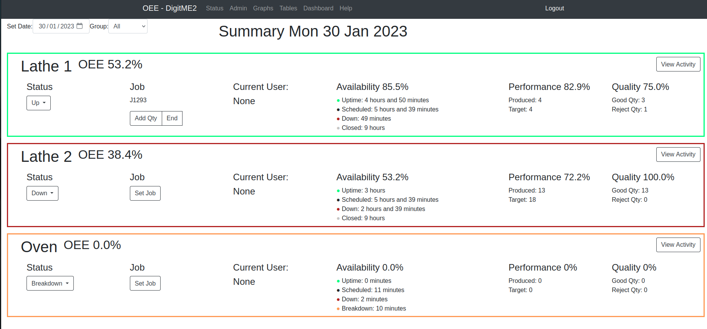
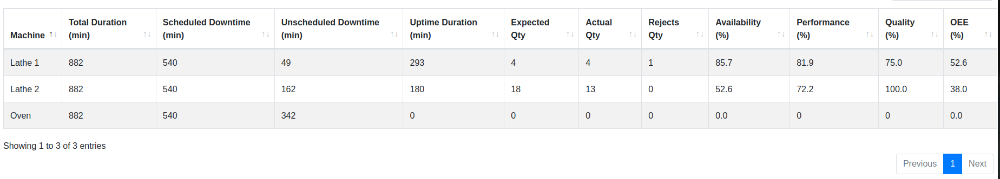
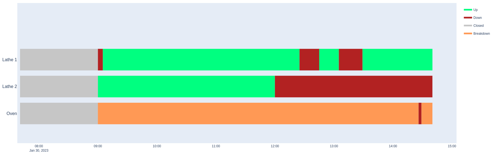

# DigitME2 OEE Monitor

 
This system was created to track Overall Equipment Effectiveness (OEE) using Android tablets and IOT devices, and is 
 capable of general data collection for uptime/downtime and production tracking.
The system is managed through a web browser, and can be deployed in the cloud and/or configured for remote operation.

A demonstration of the app in use can be found on [YouTube.](https://www.youtube.com/watch?v=DQbJFctLYT4) 

Data can be displayed in graphs or tables, which can be exported to Excel or CSV.  


This repository constitutes the central server, which is required to run the system. For recording shop floor data,
it is intended for an IOT device or Android tablet to capture the state of the machine and send the data back to this server.

[The app APK can be downloaded from here.](https://github.com/DigitME2/MachineMonitoring/releases) 

IOT Devices should send POST requests to this server's API. (Documentation below)

## Setup
### Quick Installation
The software can be automatically set up by running these commands in a terminal in Ubuntu 22.04.

Press Ctrl + Alt + T to open a terminal. To paste into a terminal, use Ctrl + Shift + V

Install curl (Enter your password if prompted):
```
sudo apt-get install curl
```

Run the installation script:

```
bash <(curl -sL https://raw.githubusercontent.com/DigitME2/oee_server/production/install.sh)
```


This will download the software and set it to run on startup. The software can be reached by opening a browser and entering "localhost" into the address bar. The default user is "admin" and the default password is "digitme2".
This can also be accessed on another PC on the network by entering the host PC's IP address into the address bar of a browser.

If this process fails on Ubuntu Server, try installing packages manually with 
`sudo apt-get install -y git npm redis virtualenv nginx`
and running the installation script again.
### Manual Installation

(Tested on Ubuntu 22.04)

Download the source code from this repository

Create `config.py` in the root folder from `example-confs/config.py.example` and edit config options. Modify the secret key to a random string

Run `npm install` in the `/app/static` directory.

The app uses redis as a Celery broker, which is needed for periodic tasks. Redis can be installed with `sudo apt install redis`. Modify `config.py` if using a non-standard redis setup.

Run `pip install -r requirements.txt` in a virtual environment if necessary.

The server can now be started by running webapp.py. `python3 webapp.py` For production usage, schedule_tasks.py and device_discovery.py also need to be run.
schedule_tasks handles scheduled tasks (e.g. setting machine state at the start/end of shifts) and device_discovery.py allows tablets to discover the server automatically.

To run at startup, the three processes can be run by systemd. Example configs are provided in the `example-confs` folder. Copy these to `/etc/systemd/system` and run `sudo systemctl daemon-reload` then `sudo systemctl enable oee_server oee_discovery oee_scheduler`. Make sure to edit the paths/user in the service config files.

For security, the app should be run by a different user. For example, create a user called oee `useradd oee` and give them ownership of the OEE app `chown -R oee /home/user/oee_server`. Ensure the app is started by the same user in your systemd service files.

The software ideally uses nginx as a reverse proxy. This can be installed with `sudo apt install nginx`. An example config is included in this repo.


This server uses flask-migrate for migrations. When the server is run for the first time, it will create the database with some default values. After this, run `flask db stamp head` to set the database to the latest version and allow future migrations.

To upgrade the database when updating to a new version, run

`flask db upgrade`


## Documentation

Help files can be found in the app

## API

An external device can change the state of a machine by posting JSON to /api/machine-state-change. The payload should be in the format `{"machine_id": 1, "machine_state": 0}`, where state=0 means the machine has gone down and 1 means back up. Instead of up/down, a specific activity can be provided instead, e.g. `"activity_code_id": 1`, this must match the database ID of an entry from the activity_code table. 

Note that a machine cannot be set to uptime without a job and this will return a HTTP 400 error.

An example script using cURL can be found in the example-confs directory
